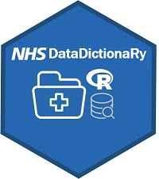

# NHSDataDictionaRy 

  <!-- badges: start -->
 
 [](https://travis-ci.com/StatsGary/NHSDataDictionaRy)
   [](https://CRAN.R-project.org/package=NHSDataDictionaRy)

  
  
The goal of this package is to provide a common set of functions for working with NHS Data Dictionary look up tables. 

## Installation

``` r
# install.packages("NHSDataDictionaRy") # if not already installed

```

## Using the package

To use the package, you can download it from CRAN, using the library command to attach to your package:

``` r
library(NHSDataDictionaRy)

```

## NHS Data Elements

When retrieving the current hyperlinks from the data elements page of R it is known that not all of these elements will have <strong>National Code</strong> tables. If a National Code table does not exist for the selected lookup table, then you will receive a message stating the lookup table requested does not exist and to try another lookup table. If you check this, you will see that the relevant data elements page of the NHS Data Dictionary does not contain that specific national codes table. 

## Additional updates

Updates are being worked on at the moment to include:
- Links to OpenSafely data
- Wrapper functions for returning nhs_data_elements all in one function

These will be made available in the next release. 

## Credits 

This package has been funded by the NHS-R community and designed in conjunction with Arden and GEM CSU. Gary Hutson is the package maintainer and can advise on bug fixes and general functionality issues. 

Please create an issue on GitHub if you have any issues or request changes. 

## Collaborators

See the superstars who have added to this package:
[](#contributors-)

