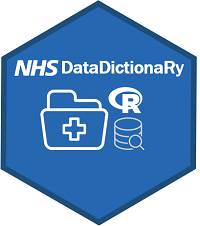

```{r, include = FALSE}
knitr::opts_chunk$set(
  collapse = TRUE,
  comment = "#>"
)
```




# Context

This package has been commissioned by the NHS-R community and is intended to be used to web scrape the [NHS Data Dictionary website](https://datadictionary.nhs.uk/data_elements_overview.html#dataElement_overview) for useful lookup tables. The package is maintained by [Gary Hutson - Head of Advanced Analytics at Arden and GEM Commissioning Support Unit](https://www.ardengemcsu.nhs.uk/) and to contact the maintainer directly you can navigate to this [site](https://hutsons-hacks.info/). 

Additionally, the package has been developed with generic web scraping functionality to allow other websites containing data tables and elements to be scraped. 

## Loading the package

To load the package, you can use the below command:

```{r setup}
library(NHSDataDictionaRy)
library(dplyr)
```

This brings in the functions needed to work with the package. The below sub sections will show how to use the package, as intended.

## Accessing the NHS data links

This function expects no return and is a way to query the NHS Data Dictionary database to get the most recent list of data elements and their associated lookups. The return of this will provide a tibble of all the links currently on the NHS Data Dictionary website:

```{r extracting_dd}
nhs_tibble <- NHSDataDictionaRy::nhs_data_elements()
print(head(nhs_tibble))
```
This tibble gives a list of all lookups and their associated xpath codes i.e. a direct link to an HTML element, which is the standard way of extracting HTML DOM content. This is where the other functions in the package become powerful. 

## Text manipulation of the tibble

The NHSDataDictionaRy package provides a couple of Microsoft Excel convience functions for working with text data. These are:

* left_xl()
* right_xl()
* mid_xl()
* len_xl()

I will demonstrate how these can be used on the tibble extracted from the previous example in the following sub sections. 

### left_xl() function

To utilise the left_xl function it expects two parameters - the first is the text to work with and the second is the number of characters to left trim by:

```{r left_xl}
#Grab a sub set of the data frame
df <- nhs_tibble[10,]
result <- NHSDataDictionaRy::left_xl(df$link_name, 22)
print(result)
class(result)

```

### right_xl() function

This works the same way as the left function, but trims from the right of the text inward:
```{r right_xl}
#Grab a sub set of the data frame
df <- nhs_tibble[10,]
result <- NHSDataDictionaRy::right_xl(df$link_name, 23)
print(result)
class(result)

```
### mid_xl() function

This function takes a slightly different approach and expects 3 input parameter, the first being the text to trim, the second being where to start trimming and the third parameter is the termination point i.e. where to stop the trimming of the string:
```{r mid_xl}
#Grab a sub set of the data frame
df <- nhs_tibble[10,]
original <- df$link_name
#Original string
result <- NHSDataDictionaRy::mid_xl(df$link_name, 12, 20)
print(original); print(result)
class(result)

```

### len_xl() function

This is a simple, but useful function, as it gets the length of the string:
```{r len_xl}
#Grab a sub set of the data frame
df <- nhs_tibble[10,]
#Original string
original <- df$link_name
string_length <- NHSDataDictionaRy::len_xl(original)
print(string_length)
class(string_length)


```


## Get all current hyperlinks from a webpage using linkScrapR

This function can analyse a website and get all the current hyperlinks of a website. This function is used to produce the nhs_data_elements() function, as it calls this function to analyse all the current hyperlinks on the NHS Data Dictionary package, but my example shows an example of scraping the NHSR community website to access the links:

```{r link_scrapeR}
# Analyse all the links on a website
website_url <- "https://nhsrcommunity.com/home/webinars/"
results <- NHSDataDictionaRy::linkScrapeR(website_url)
print(head(results, 20))

```


To navigate to the specific URL you can use the utils::browseURL command:
```{r browse_url}
#This opens the 18th result of the URL
#browseURL(results$url[18])

```

# Working with the NHS R Data Dictionary lookup

This package provides functionality for working with the nhs_data_elements extracted from the NHS Data Dictionary website. The two main useful function to extract elements are the tableR function and the xPathTextR function. These can work with the tibble returned to extract useful lookups.


## tableR function (utilising scrapeR function)

The scrapeR function is the workhorse, but the tableR wraps the results of the function in a nice tibble output. This will show you how to utilise the return tibble and to pass the function through the tableR to scrape a tibble to be utilised for lookups:

```{r tableR}
# Filter by a specific lookup required
reduced_tibble <- 
  dplyr::filter(nhs_tibble, link_name == "ACTIVITY TREATMENT FUNCTION CODE")

#Use the tableR function to query the NHS Data Dictionary website and return the associate tibble

treatment_function_lookup <- NHSDataDictionaRy::tableR(url=reduced_tibble$full_url,
                          xpath = reduced_tibble$xpath_perm_code, 
                          title = "NHS Hospital Activity Treatment Function Codes")

# The query has returned results, if the url does not have a lookup table an error will be thrown

print(head(treatment_function_lookup,10))
  
```

## Using my lookup with NHS data 

There are common lookups that are needed, and this is one such mapping between specialty code, to get the description of the specialty unit description. I will show an example with a made up data frame to illustrate the use case for these lookups and to have up to date lookups:

```{r lookup_fields}

act_aggregations <- tibble(SpecCode = as.character(c(101,102,103, 104, 105)),
                             ActivityCounts = round(rnorm(5,250,3),0), 
                             Month = rep("May", 5))

# Use dplyr to join the NHS activity by specialty code

act_aggregations %>% 
  left_join(treatment_function_lookup, by = c("SpecCode"="Code"))
  
# This easily joins the lookup on to your data
  
```
The benefit of having it in an R package is that you can instantaneously have a lookup of the most relevant and up to date NHS lookups, replacing the need to have a massive data warehouse to capture this information. 

## xpathTextR function

This function has been provided to return elements from a website, other than html tables, as these functions predominately work with tables. The below example shows how this can be implemented, but requires the retrival of the xpath via the Inspect command in Google Chrome
